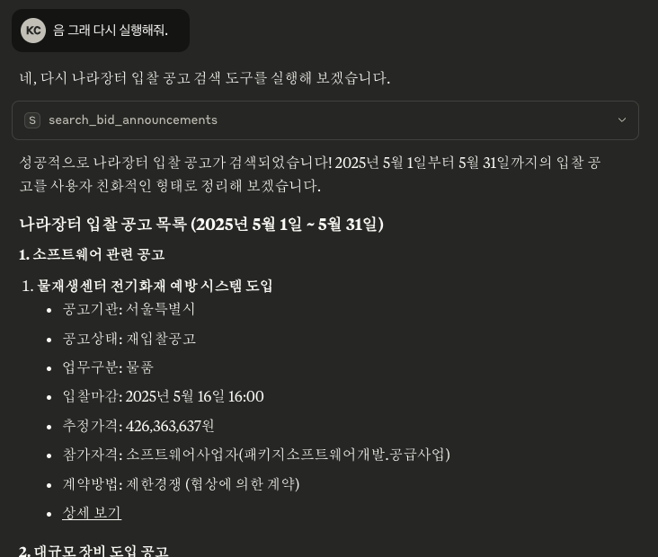

# naramarket-mcp
나라장터 API를 활용한 MCP 서버 프로젝트입니다. 
나라장터 데이터를 수집 및 가공하여 MCP 형태로 제공합니다.

## 📦 프로젝트 개요
- **이름**: naramarket-mcp
- **설명**: naramarket-mcp는 AI 애플리케이션(ex: Claude Desktop)에서 나라장터의 공고를 검색/활용 할 수 있도록 MCP(Model Context Protocol) 서버로 제공합니다.
- **언어**: Go
- **의존성**: 
  - https://github.com/mark3labs/mcp-go
  - https://github.com/patrickmn/go-cache

## 🚀 주요 기능
- 입찰 공고 검색: 조달청 나라장터의 입찰 공고를 기간, 키워드 등의 조건으로 검색합니다.
- MCP 서버: Mark3Labs의 MCP-Go 라이브러리를 활용한 MCP 서버 구현으로 ChatGPT나 Claude와 같은 AI와 쉽게 통합됩니다.
- 사용자 친화적 출력: 복잡한 조달 정보를 이해하기 쉬운 형태로 가공하여 제공합니다.
- 로컬 캐싱: API 호출 횟수를 줄이고 응답 시간을 개선하기 위한 로컬 캐싱을 지원합니다.

## ⚠️ 필수 조건
- Go 1.18 이상
- Claude 데스크탑 (또는 다른 MCP 호환 클라이언트)
- 공공데이터포털 API 키 (조달청-나라장터 공공 데이터 개방 표준 서비스)
- 
## 🛠 설치 및 실정 방법
### 1. 설치
```bash
# 1. 레포지토리 클론
git clone https://github.com/your-username/narajangteo-mcp-server.git
cd narajangteo-mcp-server

# 2. 의존성 설치
go mod tidy

# 3. 빌드
go build -o naramarket-mcp
```
### 2. 설정(Claude Desktop)
Claude 데스크탑 구성 파일에 MCP 서버를 등록합니다.
- mackOS:
  ```
  // ~/Library/Application Support/Claude/claude_desktop_config.json
  {
    "mcpServers": {
      "naramarket-mcp": {
        "command": "naramarket-mcp의 절대 경로",
        "args": [],
        "env": {
          "serviceKey": "공공데이터포털의_API키"
        }
      }
    }
  }
  ```
- Windows:
  ```
  // // %APPDATA%\Claude\claude_desktop_config.json
  {
    "mcpServers": {
      "naramarket-mcp": {
        "command": "naramarket-mcp의 절대 경로",
        "args": [],
        "env": {
          "serviceKey": "공공데이터포털의_API키"
        }
      }
    }
  }
  ```

## 사용 방법
일반적으로 Claude 데스크탑에서 자동으로 MCP 서버를 실행합니다. 
수동으로 실행하려면:
```bash
./naramarket-mcp
```
Claude 데스크탑에서 다음과 같은 질문들을 할 수 있습니다.
 - "최근 입찰 공고를 검색해줘"
 - "지원할 만한 공고가 있어?"
 - "마감이 임박한 공고를 알려줘"

<p align="center">
  
</p>

## 🛣 개발 이정표

| 기능 | 상태 | 비고 |
|------|------|------|
| 나라장터 API 연동 | ✅ 완료 | 공공 데이터 포털을 통한 서비스키 기반 |
| MCP 응답 제공 | ✅ 완료 | HTTP JSON 형태 응답 |
| 환경변수 설정 및 실행 문서화 | ✅ 완료 | .env 파일 기반 |
| **로컬 캐싱 기능** | 🚧 개발 예정 | API 호출 제한 및 대용량 응답 대응 목적 |
| 에러 응답 형식 표준화 | 🔜 예정 | 클라이언트 측 디버깅 용이성 향상 |
| 테스트 코드 작성 및 커버리지 측정 | 🔜 예정 | `go test` + coverage badge 목표 |

> ❗ 진행 상태는 GitHub Issue 또는 프로젝트 탭과 연동될 수 있습니다.
